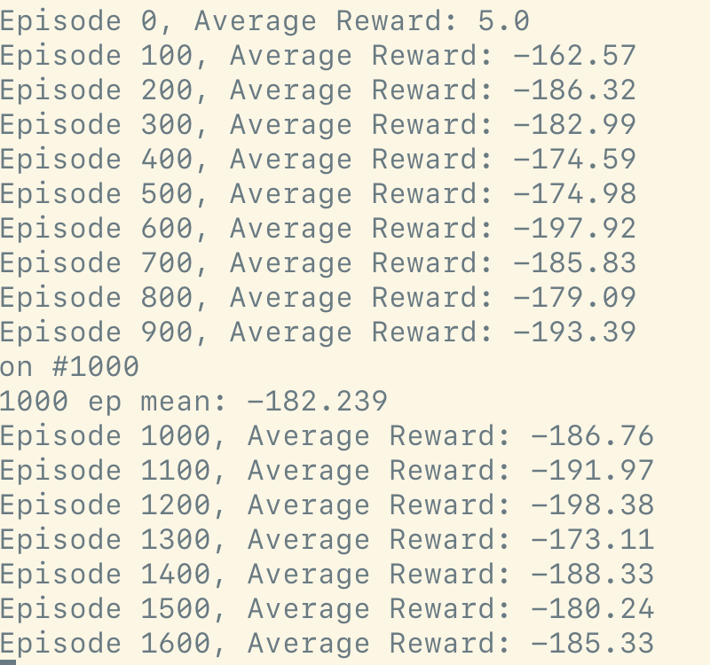
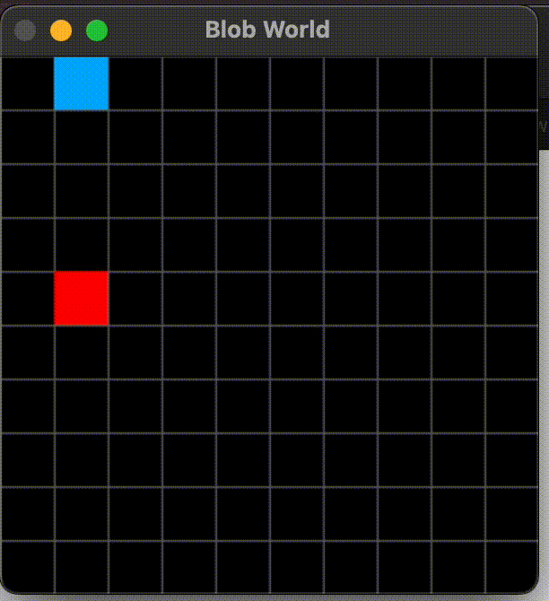

# Vanilla Policy Gradient (VPG) Implementation

## TLDR
A simple PyTorch Reinforcement Learning model where an agent learns to move towards food while avoiding enemies on a 2D grid, based on log-probabilities and policy updates using backpropagation through time.

## Short Overview of VPG

- Stochastic policy: $\pi(a|s,\theta)$
  where $\pi$ represents the probability of taking action $a$ given state $s$ and parameters $\theta$.

- The objective is to change parameters $\theta$ to maximize expected rewards.

- Unlike TD learning, there's no need for calculating Q-value or V-value.

- Better suited for continuous state spaces.

## Mathematical Foundation

The goal in policy gradient methods is to maximize the expected return:

$J(\theta) = \mathbb{E}_{\tau \sim \pi_\theta}[\sum_{t=0}^T R(s_t, a_t)]$

where $\tau$ represents a trajectory, and $R(s_t, a_t)$ is the reward at time $t$.

The policy gradient theorem gives us:

$\nabla_\theta J(\theta) = \mathbb{E}_{\tau \sim \pi_\theta}[\sum_{t=0}^T \nabla_\theta \log \pi_\theta(a_t|s_t) R_t]$

where $R_t = \sum_{t'=t}^T R(s_{t'}, a_{t'})$ is the return from time $t$.

## Environment

The environment in this problem is a simple 2D grid-based world where there are 3 blobs (player, food, and enemy). The objective of the RL agent is to move towards the food blob while avoiding the enemy blob by choosing appropriate actions based on its current state.

The environment is represented as a numpy array of size SIZE x SIZE where each cell can contain one of 3 blobs. The input for the policy network consists of the relative positions of these 3 blobs in the current state.

## Reinforcement Learning Approach

In this code, we use PyTorch to build a simple policy gradient RL model with a neural network that represents our policy function.

This network takes our state representations as input and outputs a probability distribution over possible actions. Mathematically, for a state $s$:

$\pi_\theta(a|s) = \text{softmax}(f_\theta(s))$

where $f_\theta$ is our neural network.

The agent then selects an action based on these probabilities using the Categorical distribution's sample method.

## Implementation

```python
class PolicyNetwork(nn.Module):
    def __init__(self, input_size, output_size):
        super(PolicyNetwork, self).__init__()
        self.fc = nn.Sequential(
            nn.Linear(input_size, 64),
            nn.ReLU(),
            nn.Linear(64, 64),
            nn.ReLU(),
            nn.Linear(64, output_size)
        )

    def forward(self, x):
        return torch.softmax(self.fc(x), dim=-1)

def select_action(state):
    state = torch.FloatTensor(state).unsqueeze(0)
    probs = policy_net(state)
    m = Categorical(probs)
    action = m.sample()
    return action.item(), m.log_prob(action)

def update_policy(log_probs, rewards):
    returns = []
    G = 0
    for r in reversed(rewards):
        G = r + 0.99 * G  # 0.99 is the discount factor
        returns.insert(0, G)
    returns = torch.tensor(returns, dtype=torch.float32)
    
    if len(returns) > 1:
        returns = (returns - returns.mean()) / (returns.std() + 1e-8)  # Normalization
    
    policy_loss = []
    for log_prob, R in zip(log_probs, returns):
        policy_loss.append(-log_prob * R)  # Negative because we're doing gradient ascent
    
    optimizer.zero_grad()
    policy_loss = torch.stack(policy_loss).sum()
    policy_loss.backward()
    optimizer.step()
```


<br>


## Mathematical Explanation of the Update Step

1. We calculate the returns $G_t$ for each timestep:

   $G_t = \sum_{k=0}^{T-t} \gamma^k r_{t+k}$

   where $\gamma$ is the discount factor (0.99 in this code).

2. We normalize the returns to reduce variance:

   $G_t' = \frac{G_t - \mu(G)}{\sigma(G)}$

3. The policy loss for each step is calculated as:

   $L_t = -\log \pi_\theta(a_t|s_t) G_t'$

4. The total loss is the sum of these individual losses:

   $L = \sum_t L_t$

5. We then use backpropagation to compute $\nabla_\theta L$ and update our policy parameters:

   $\theta \leftarrow \theta - \alpha \nabla_\theta L$

   where $\alpha$ is the learning rate.

This implementation follows the core principles of the REINFORCE algorithm, a fundamental policy gradient method in reinforcement learning.


full code here [vpg.py](./code/vpg.py)

